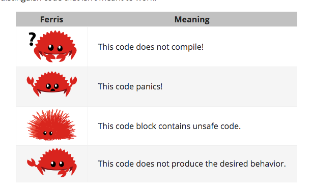

# Introduction

- Note: 이 문서는 https://nostarch.com/rust 여기에 있는 The Rust Programming Language(책/ebook 둘다 제공) 랑 같다. 
    - 출판사: [No Starch Press](https://nostarch.com/)

The Rust Programming Language - Rust 입문서 - 에 오신걸 환영합니다~. Rust는 더 믿을만한/안정적인 코드를 더 빨리 짤 수 있도록 해줍니다. 고수준의 직관적인것과, 저수준의 컨트롤을 할 수 있는건 주로 프로그래밍 언어 디자인을 할때 동시에 가지긴 힘든 일인데, Rust가 이 장점을 모두 가져갈 수 있도록 도전하고 있습니다. 훌륭한 개발적인 능력과 개발 경험이 있다면 Rust는 저수준의 디테일(메모리 사용같은)도 할 수 있는 선택권을 줍니다. 예전에는 이런것들을 하려면 많은것들을 해야했는데, 이제 그런 것들이 없이 할 수 있게 됬습니다. 

## Who Rust Is For

Rust는 여러 이유로 많은 사람들에게 좋습니다. 아래는 대표적인 예입니다!

### Teams of Developers

Rust는 여러 수준의 프로그래밍 지식을 가진 거대한 팀이 협력 할 수 있는 생산적인 툴임을 증명하고 있습니다. 저수준의 코드는 다른 언어에서는 수많은 테스트와 경험이 많은 개발자들의 주의 깊은 코드리뷰를 통해서만 발견될 다양한 미묘한 버그들에 취약한 경향이 있습니다. Rust에서는 컴파일러가 이런 미묘한 버그들과 동시성(concurrency) 관련 버그 있으면 컴파일을 안해줍니다. 이런 컴파일러와 함께, 팀은 버그를 잡는데보다 프로그램의 로직에 더 집중할 수 있습니다. 

Rust는 또한 현대/최신의 개발 도구들을 시스템 프로그래밍 세계에 도입했습니다. 
  * Cargo: Dependency manager / Build tool 역할을 하는 Cargo는 adding, 컴파일링, 그리고 머리 안아프고 일관성있게 Rust 환경에서 디펜던시를 관리할 수 있게 해줍니다. 
  * Rustfmt: 일관적인 코드스타일을 강제합니다. 
  * The Rust Language Server: 코드 완성과 inline error message를 볼 수 있는 IDE를 제공합니다

이 툴들과 Rust 생태계의 다른 툴들을 활용하면 시스템 레벨 코드를 작성하면서도 생산적일 수 있습니다. 

### Students

Rust는 systems concpets에 관심이 있는 학생들을 위해 좋습니다. Rust를 통해서 OS개발 같은 개념들을 익힐 수 있습니다. Rust 커뮤니티는 학생들의 질문을 반기고 환영합니다!! 이런 책을 쓰는 것도, Rust 팀은 더 많은 사람들이 systems concepts개념을 이해할 수 있으면 좋겠습니다. 그리고 특히 프로그래밍이 처음 분들에게는 더 도움이 되면 좋겠습니다.  

### Companies

많은수의 작고 큰 회사들은 프로덕션 환경에서 다양한 업무를 위해 Rust를 사용하고 있습니다. Cli 툴이나, 웹서비스, 데브옵스 툴, 임베디드 기기, 오디오 및 비디오 분석, transcoding, 가상화폐, 생체공학, 서치 엔진, IOT, 머신러닝, 그리고 파이어 폭스의 많은 부분을 Rust가 담당하고 있습니다!!

### Open Source Developers

Rust는 Rust 프로그래밍 언어/ 커뮤니티/ 개발자 도구 그리고 라이브러리를 만들고 싶은 사람들을 위한 것이기도 합니다. 우리는 당신이 Rust언어에 기여해주면 진짜 좋겠습니다!

### People Who Value Speed and Stability
Rust는 속도와 안정성을 모두 갈망하는 사람들을 위한 언어입니다. 여기서 말하는 스피드는 Rust로 만든 프로그램의 속도와 Rust로 그 프로그램을 만드는데 소요되는 시간을 모두 말합니다(긍까, 짱좋다 이말). Rust 컴파일러의 검사는 기능 추가 및 리팩토링을 할때 안정성을 보장해줍니다. 이런 특징은 컴파일러에서 이런 검사를 하지 않는 깨지기 쉬운 레거시 코드(개발자들은 이런 코드를 바꾸는것을 두려워합니다..ㅠㅠ 저도요ㅠㅠ)와 아주 큰차이입니다. zero-cost abstractions / higher-level 기능에서 lower-level 코드로 손수 쓴것처럼 빨리 컴파일 되는 것을 추구함으로써, Rust는 안전한 코드가 빠른 코드가 될수 있도록 노력하고 있습니다. 

Rust는 여러 유저를 지원하고 싶습니다. 여기에서 언급한 그룹은 그냥 가장 제일 대표적인 그룹일 뿐입니다. Rust의 가장큰 목표는 안정성, 생산성 스피드 그리고 직관적인 사용법(인체공학적)을 제공함으로써 프로그래머들이 수십년간 받아들여야했던 trade-off(뭐하나를 얻으면 하나를 잃는..) 를 없애는 것입니다. 이게 당신에게 잘맞는지 한번 써보세요

## Who This Book Is For

이책은 당신이 다른 언어로는 프로그래밍을 해봤다고 가정하지만, 어떤거로 했는지는 아무 가정도 하지 않고 있습니다. 우리는 여러 프로그래밍 배경지식을 가진 사람들 전반에게 모두 이해가 되는 책을 만들기 위해 노력했습니다. 우리는 프로그래밍이 뭔지, 어떻게 이를 생각해야할지에 대해서는 시간을 많이 쓰지 않습니다. 만약 당신이 프로그래밍에 완전 처음이라면 프로그래밍 기초에 대해서 알려주는 책을 읽는것이 좋을 것입니다. 

## How to Use This Book

이책은 당신이 이책을 앞에서부터 뒤로 읽는다고 가정하고 있습니다. 뒤의 챕터는 이전의 챕터를 기반으로 하고 있고, 앞의 챕터는 한 주제에 대해서 깊이 설명하지 않을 수 있습니다. 우리는 이런 컨셉들을 뒤의 챕터에서 다시 다룹니다. 

이책에는 개념 챕터와 프로젝트 챕터가 있습니다. 개념 챕터에서는 Rust에 대해서 배울 것입니다. 프로젝트 챕터에서는 작은 프로그램을 만들면서 우리가 배운 것들을 적용해 볼 것입니다. Chapter2, 12, 20 이 프로젝트 챕터이고, 나머지는 개념 챕터입니다. 

챕터1은 Rust를 어떻게 설치하는지, 어떻게 `"Hello,World!"` 출력하는 프로그램을 만드는지, 어떻게 Cargo(Rust의 패키지매니저이자 빌드 툴)를 쓰는지를 알려줍니다. 

챕터2는 Rust를 소개하는 챕터입니다. 여기선 개념에 대해서 high-level로 다를 것이고, 뒤의 챕터에 대해서 추가적인 디테일한 내용을 배울 것입니다. 만약 바로 실습을 해보고 싶으면 챕터2가 딱 좋습니다. 

처음에 Chapter3를 건너뛰고 싶을 수 잇습니다. 여기선 다른 언어와 비슷한 Rust의 특징들을 다룰 것이고, Chapter4에서는 Rust의 ownership ststem에 대해서 배울 것입니다. `그러나 만약에 한단계 한단계 모든 디테일을 알고 싶은 학습자라면 Chapter2를 건너뛰고 Chapter3를 먼저 다룬 이후에 다시 챕터2로 돌아와서 프로젝트를 하면 좋을 것입니다.`

Chapter5는 structs와 methods를 다루고, Chapter6는 enum / `match` expressions, 그리고 `if let` control flow construct를 다룹니다. Rust에서 커스텀 타입을 만들기 위해 structs와 enums를 사용할 것입니다. 

Chapter7에서는 Rust의 모듈 시스템과 코드 구성을 위한 privacy rules, 그리고 public Application Interface 에 대해서 배울 것입니다. Chatper8는 표준 라이브러리에서 제공하는 자주 쓰이는 collection data structures에 대해서 다룰 것입니다. 예를들자면, 벡터, 스트링 해쉬맵입니다. 

Chapter9에서는 Rust의 에러 처리 철학과 기술에 대해서 다룰 것입니다. 

Chapter10은 제네릭, traits, lifetimes에 대해서 다룰 것입니다. 이것들은 당신이 코드를 정의하고 여러 타입들에 적용할 수 있도록 할 것입니다. 

Chpater11에서는 테스팅에 관한 모든것!! 입니다. Rust가 안전성을 보장하지만, 여전히 테스팅은 프로그램 코드의 로직이 정확한지 검증하기 위해서 여전히 필요한 절차입니다.

Chapter12는 `grep` cli tool(파일안의 텍스트를 찾는 명령어)에 기능을 집어 넣어 볼것입니다. 이것을 위해서 앞에서 다룬 많은 개념들을 다룰 것입니다. 

Chapter13는 Closure와 Iterators에 대해서 다룰 것입니다: 이건 함수형 프로그래밍에서 온 Rust의 특징입니다. 

Chapter14에서는 Cargo에 대해서 깊이 있게 다루고, 내 라이브러리를 다른 사람들과 공유하는 베스트 프랙티스에 대해서 다룰 것입니다. 

Chpater15에서는 표준 라이브러리가 제공하는 smart pointer와 이러한 기능들이 동작할 수 있게 하는 특징들에 대해서 다룰 것입니다. 

Chapter16에서는 다양한 concurrent programming 모델에 대해서 얘기를 나누고, 어떻게 Rust가 여러 쓰레드를 두려워하지 않으면서 사용할 수 있도록 도와주는지 다룰 것입니다. 

Chapter17에서는 Rust idioms와 객체 지향 프로그래밍 원칙을 비교할 것입니다. 

Chapter18는 패턴, 패턴 매칭에 관한 내용입니다. 이건 Rust프로그램에서 아이디어를 표현할 수 있는 강력한 방법입니다. 

Chapter19는 `a smorgasbord of advanced topics of interest` 를 포함하고 있습니다. unsafe rust, macros, 그리고 추가적인 lifetimes에 대한 내용, traits, types, functiomns, 그리고 closure에 대해서 다룰 것입니다. 

Chapter20에서 low-level multithreaded web server를 만드는 프로젝트를 해볼 것입니다!

마지막으로 어떤 부록들은 Rust에 대해서 참조할 수 있는 형태로 유용한 정보를 포함하고 있습니다. Appendix A는 Rust의 키워드를 다루고, Appendix B는 Rust의 연산과 심볼, Appendix C는 표준 라이브러리에서 제공하는 `derivable traits` 을 다룰 것입니다. 그리고 Appendix D는 몇몇의 유용한 개발도구들을 다루고, Appendix E는 Rust Editions에 대해서 설명할 것입니다. 

이책을 읽는데에 틀린 방법은 없습니다.만약 당신이 원한다면 앞에는 건너뛰어도 됩니다! 혼란스러울때 앞의 챕터로 돌아와도 됩니다! 당신에게 제일 맞는 방법으로 공부하세요

Rust를 배우는 과정중 중요한 부분은 컴파일러가 보여주는 에러메시지를 어떻게 이해할지 입니다. 이건 잘동작하는 코드를 짜도록 가이드 해줄 석입니다. 우리는 에러메시지와 함께 컴파일이 되지 않는 많은 예제들을 보여줄 것입니다. 이것을 통해서 각 상황에서 발생하는 에러메시지를 볼 수 있습니다. 어떤 코드를 실행했을때 동작하지 않을 수 있다는 것을 기억하세요!! 예제 코드 주변의 글들을 확인하고, 오류가 나도록 만들어진 코드인지 확인하세요!! Ferris 가 동작하지 않도록 만들어진 코드를 표시해줄 겁니다!

- https://doc.rust-lang.org/book/ch00-00-introduction.html 의 Ferris 그림

대부분의 경우에 이책은 컴파일 되지 않는 코드의 동작하는 버전을 제공합니다. 

## Source Code
책에서 사용되는 소스코드는 [여기](https://github.com/rust-lang/book/tree/master/src) 에 있다. 

[출처](https://doc.rust-lang.org/book/ch00-00-introduction.html)